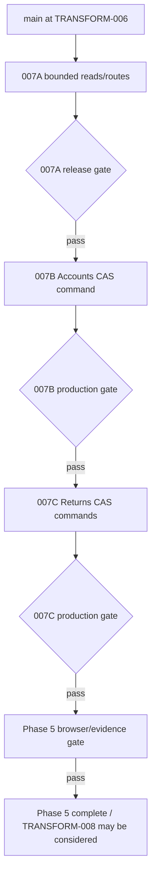
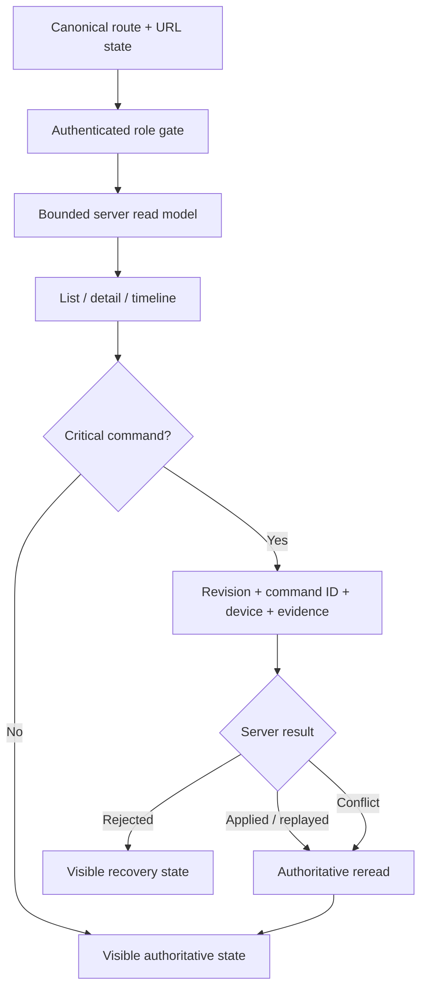

# Work Package: `TRANSFORM-007 Operational Records`

## Objective

Complete the Phase 5 operational and commercial loop by making Inventory,
Customers, Accounts and Returns first-class, bounded, server-authoritative routes
inside the unified shell, then expose only the two critical mutation boundaries
whose revision, idempotency, actor/device and audit contracts have independently
passed their release gates.

`TRANSFORM-007` was intentionally delivered in authority order:

1. `007A` — bounded four-domain reads and native routes;
2. `007B` — Accounts hold/release command authority;
3. `007C` — Returns disposition/closure command authority;
4. Phase 5 browser/UI evidence and release record.

The earlier “writes remain withheld” language in this work package described the
`007A` epoch. `007B` and `007C` are now released only because their later CAS,
idempotency, RLS, audit and production rollback gates passed.

## Owner and reviewers

- Implementation role: Platform/Data + Frontend.
- Verification role: independent Verification exact-SHA evidence required.
- Chief Engineer: protected route, migration and shell review required.
- Dependencies: merged `TRANSFORM-005` product identity/warehouse authority and
  merged `TRANSFORM-006` delivery/driver authority.
- Required merge order: `007A` authoritative reads/routes, then `007B` Accounts
  hold command, then `007C` Returns disposition/closure commands.

## In scope

- Phase 5 read authority for Inventory, Customers, Accounts and Returns.
- Canonical `/inventory`, `/customers`, `/accounts`, `/returns` list/detail
  surfaces in the unified shell while preserving `/reconciliation`.
- Exact-count, bounded page reads and bounded detail timelines.
- Account hold state, reason, affected value/status and release-role policy.
- Return lifecycle from report through explicit inventory consequence.
- `007B` Accounts hold/release through server-owned CAS/idempotent command
  authority only.
- `007C` inspected disposition/close through server-owned CAS/idempotent command
  authority only.
- Browser evidence for Owner/Account/Viewer route and denial behavior.

## Out of scope

- Delivery/Driver domain cores and route-authority migrations.
- Ordermentum import, mirror and invoice-detail sync workflows.
- Analytics implementation or Phase 6 forecasting/scoring.
- Legacy Inventory, Stores, Accounts enhancer and Returns panel rewrites.
- Existing deployed migration edits.

The following authority boundaries remain unchanged:

- Ordermentum owns commercial order, invoice, payment, pricing and customer
  master facts.
- Approved warehouse ledger/location balances remain the physical authority.
- Existing Orders account-hold gating remains visible and fail closed.
- Warehouse and Driver continue using their dedicated role surfaces.
- No new DOM observer/enhancer or broad all-domain first-paint loader is added.
- Independent source-sync failures are not repaired or waived by this package.

## Behaviour contract

### `007A` bounded reads and routes

- Input: authenticated workspace, view, page, page size, search/filter/sort, or a
  canonical record identifier.
- Accepted result: exact total plus at most 100 rows, or bounded typed detail
  records plus one server read timestamp.
- Rejected result: unknown workspace/view, invalid page/limit/identifier or an
  unauthorised role fails closed; no cached cross-role fallback is rendered.
- Server checks: active authenticated profile and explicit workspace role
  allow-list inside security-definer RPCs.
- Mutation: none. `007A` remains a read authority.
- Offline/read failure: unavailable/stale-safe UI; no sample-data substitution.

### `007B` Accounts hold command gate

- Command: set or clear a store release hold with target state, mandatory reason,
  expected revision, UUID command id and bounded device id.
- Accepted result: `APPLIED` plus authoritative snapshot and incremented
  revision.
- Conflict result: `CONFLICT` plus current snapshot, with no mutation.
- Retry result: identical command/payload returns `REPLAYED`; command-id payload
  mismatch is rejected.
- Server checks: authenticated `OWNER`, `ADMIN` or `ACCOUNT`, known store,
  expected revision and non-empty reason.
- Audit: append-only actor/role/device/reason/before/after/timestamp evidence.
- Browser policy: no direct hold-table DML and no optimistic success.

### `007C` Returns disposition and close gate

- Commands: record an inspected disposition, or close a return.
- Envelope: expected revision, UUID command id, device id, mandatory note and
  bounded evidence.
- Accepted result: `APPLIED` plus authoritative lifecycle snapshot.
- Conflict/retry: same CAS and idempotency semantics as `007B`.
- Rejected result: not physically received, illegal transition, RESTOCK without
  barcode/location, missing explicit consequence, wrong role or stale revision
  fails closed.
- Server checks: authenticated `OWNER`, `ADMIN` or `WAREHOUSE` and current return
  authority.
- RESTOCK consequence: must use/link the existing governed inventory movement
  authority; browser code does not insert inventory movements directly.
- Non-restock consequence: explicit supplier-claim/dispose consequence; never
  inferred away.
- Audit: append-only actor/device/reason/before/after/linked-movement evidence.
- Browser policy: unresolved acknowledgement retains the same command UUID and
  original expected revision; no optimistic closure.

## Phase flow

## Runtime authority flow

## Acceptance criteria

- [x] Inventory exposes Overview, By SKU, By location, Below target,
  Negative/inconsistent, Movement ledger and Cycle count views.
- [x] Inventory SKU detail uses live location authority and exposes commercial
  SKU/family, physical SKUs, packages, barcodes, demand, target, movements and
  unresolved identity exceptions where data exists.
- [x] Customers expose Overview, Orders, Delivery, Pricing, Accounts, Contacts
  and Timeline without unbounded cross-domain datasets.
- [x] Accounts show hold reason, effective time, open/overdue value/status and
  release-role policy; existing Orders hold behavior remains covered.
- [x] Returns show reported, received, inspected, disposition, consequence and
  closed state; missing consequence remains explicit.
- [x] `/inventory`, `/customers`, `/returns` and `/accounts` are first-class
  unified routes with shareable filter/detail URL state.
- [x] Role/RPC tests prove Account cannot read Inventory, Viewer cannot read
  Accounts/Returns and public/anon cannot execute the read RPCs.
- [x] First paint fetches only the selected workspace page; bounded detail reads
  begin only after record selection.
- [x] Existing Control Room, Orders, Warehouse, Delivery/Driver and legacy
  `/reconciliation` remain usable.
- [x] `007B` and `007C` were not exposed before their CAS, replay, rejection, RLS
  and audit tests passed.
- [x] Final `007A` head `e022252da6e41c6e57b698f79b4a9715941cb9a0`
  and current test-merge `ae52f3afd90b09c21064f50a28b4e8192592b4e1`
  received `Supabase shadow gate (required)=success` from trusted-main run
  `31509683234`, followed in order by Final exact-SHA Verification PASS and
  Final exact-SHA Chief Engineer PASS.
- [x] `007B` production release verification passed authoritative Accounts read,
  role denial, hold/readback/clear/readback, rollback restoration and browser
  source-write denial.
- [x] `007C` production rollback smoke passed revision CAS, idempotent replay,
  stale conflict, RESTOCK movement linkage, close/rollback and browser bypass
  denial.
- [x] Native `007C` Returns command UI is merged and main integration checks are
  green.
- [x] Phase 5 browser evidence covers Owner/Account/Viewer route matrix, Owner
  list/detail for all four domains and one denied-role screenshot, with zero
  business mutation during evidence capture.

## Test plan

| Layer | Command or scenario | Expected result |
|---|---|---|
| Static | `node scripts/audit-transform-007-operational-records.mjs` | migration, role, bound and route invariants pass |
| Release safety | trusted-main shadow bootstrap contract | PR code never receives production DB credentials; candidate applies only in credential-free local PostgreSQL |
| Unit | `scripts/transform-007-operational-records-frontend-contract.test.mjs` and command UI contracts | canonical route/repository/surface and command-boundary contracts pass |
| Integration/RLS | PostgreSQL fixtures + `transform-007*contract-test.sql` | pagination, detail, role denial, CAS, idempotency and consequence facts pass |
| Supabase shadow | `TRANSFORM-007 trusted Supabase shadow` | production schema/history read succeeds and exact pending candidate applies to isolated PostgreSQL 17 |
| Production | `007B` and `007C` rollback-safe release verifiers | live authority/readback/denial semantics pass without retained synthetic business state |
| Build | `npm run typecheck && npm run build` | production TypeScript and bundle pass |
| Regression | operational safety, warehouse, commercial, intelligence and repository-hygiene gates | earlier authority gates stay green |
| End-to-end/UI | credential-free Playwright Owner/Account/Viewer route matrix on exact-main production build | list/detail/denial surfaces render and no mutation RPC is invoked |

## Phase 5 completion evidence — 2026-08-13

### `007A` final merge authority

- PR #274 merged exact head:
  `e022252da6e41c6e57b698f79b4a9715941cb9a0`.
- Trusted-main run `31509683234` passed:
  - production schema and migration-history read;
  - exact candidate blob sealing;
  - credential-free PostgreSQL 17 apply;
  - publication of `Supabase shadow gate (required)` to exact head and validated
    test-merge `ae52f3afd90b09c21064f50a28b4e8192592b4e1`.
- PR #274 comments record, in order:
  1. `Final exact-SHA Verification — PASS` for the same head;
  2. `Final exact-SHA Chief Engineer — PASS` for the same head, after
     Verification.
- These are role-based exact-SHA records under the documented single-maintainer
  model, not a claim of a second human GitHub approval.

### `007B` production authority

- Accounts release gate passed after the read-timeout/source-authority repair
  sequence.
- Production Accounts RPC returned a bounded 25-row page in 983 ms in the final
  verification.
- VIEWER failed closed.
- Hold → authoritative readback → clear → authoritative readback passed.
- Transaction rollback restoration passed.
- anon/authenticated browser writes to source-owned commercial relations remained
  denied.

### `007C` production authority and native UI

- PR #293 added migration
  `20260813060000_transform_007c_return_commands.sql` and merged through the
  protected shadow gate.
- Production release smoke recorded:
  - `RETURN_REVISION_CAS=PASS`
  - `RETURN_IDEMPOTENT_REPLAY=PASS`
  - `RETURN_STALE_CONFLICT=PASS`
  - `RETURN_RESTOCK_MOVEMENT_LINK=PASS`
  - `RETURN_CLOSE_ROLLBACK=PASS`
  - `RETURN_BROWSER_BYPASS=DENIED`
  - `SYNTHETIC_RETURN_ROLLBACK=PASS`
- Supabase deploy completed `shadow-verify → deploy → finalize` successfully.
- PR #294 exposed the already released authority through the native Returns
  drawer; no migration was changed. It merged normally after current exact-head
  checks, Vercel and required trusted status succeeded.
- Main after #294 was
  `5f791ed55ead7b7ed6835fc4d45e9a3185f9b8e9`; its main-push workflows completed
  without failure and Vercel reported success.

### Browser/UI evidence

Successful evidence run: `31666652317`.

Exact application source under test:
`5f791ed55ead7b7ed6835fc4d45e9a3185f9b8e9`.

The evidence workflow proves, separately:

1. that exact SHA has a successful Vercel Production deployment; and
2. the exact same SHA checks out cleanly, builds in production mode and passes
   browser tests under Chromium.

Vercel Deployment Protection redirects unauthenticated CI from the commit-specific
Production URL to `vercel.com/login`. No bypass secret is present and none is
introduced. Therefore the browser portion does **not** claim direct execution
against the protected Vercel URL. It runs the exact-main production build under
local `vite preview`, while browser networking intercepts Supabase auth/REST/
functions and supplies deterministic role/read fixtures. This keeps production
credentials and customer data out of the test and makes any attempted `007B` or
`007C` mutation an explicit test failure.

Evidence result:

- Playwright: `2 passed`.
- Route matrix: OWNER / ACCOUNT / VIEWER PASS.
- Owner desktop list/detail: Inventory / Customers / Accounts / Returns PASS.
- Accounts detail visibly contains the `007B` account-hold authority panel.
- Returns detail visibly contains the `007C` disposition/close authority panel.
- Viewer `/accounts`: `Workspace not authorised` PASS.
- Business mutation during evidence: `0`.
- Production Supabase data requests during evidence: `0`.
- Required screenshots: 9/9 PASS.

Artifact:

- ID: `9168186338`
- name:
  `transform-007-phase5-ui-evidence-5f791ed55ead7b7ed6835fc4d45e9a3185f9b8e9`
- size: 1,027,262 bytes
- SHA-256:
  `83d454f633c18bb29956d7d72ac96078361bd441b3e0598193bca9084485679d`
- screenshot set:
  - `owner-inventory-list.png`
  - `owner-inventory-detail.png`
  - `owner-customers-list.png`
  - `owner-customers-detail.png`
  - `owner-accounts-list.png`
  - `owner-accounts-detail.png`
  - `owner-returns-list.png`
  - `owner-returns-detail.png`
  - `viewer-accounts-denied.png`

The screenshots were visually inspected after artifact download; they show the
expected native workspaces/detail drawers and the explicit Viewer denial state,
not login, blank or generic error pages.

The evidence workflow is configured to rerun on `main` after this evidence PR is
merged, so final Phase 5 closure remains bound to the resulting main SHA rather
than only to this evidence branch.

## Required evidence status

- [x] Versioned read/command migrations, typed repositories, native surfaces and
  bounded route/shell integrations are in main.
- [x] Static, frontend, PostgreSQL, TypeScript/build and regression gates pass.
- [x] Trusted production-schema shadow enforcement is active and exact-SHA bound.
- [x] `007B` and `007C` production release verifiers pass.
- [x] Owner four-domain list/detail screenshots and one denied-role screenshot
  exist in a hashed workflow artifact.
- [x] Current main application integration has no red workflow.

## Known limitations and deferred findings

- The commit-specific Vercel Production URL is protected by Vercel Deployment
  Protection. Automated browser evidence therefore verifies the exact-main
  production build locally while Vercel deployment success is proven separately.
  This is an explicit evidence boundary, not a bypass.
- Historical return rows may expose missing consequence evidence. This remains a
  surfaced data-quality state and is not silently repaired.
- Independent Ordermentum/source-sync findings remain outside this package and
  must not be silently absorbed into Phase 6 work.
- `TRANSFORM-008` was forbidden while this evidence package was incomplete. It
  may be considered only after this completion-evidence PR itself passes the
  protected gate, merges, and the resulting main evidence run succeeds.

## Protected merge sequence — completed history

1. Bootstrap trusted-main shadow infrastructure separately from product SQL.
2. Protect `main` with the required `Supabase shadow gate (required)` and no
   bypass actor.
3. Merge `007A` only after exact-head/test-merge shadow plus ordered Verification
   and Chief Engineer evidence.
4. Verify/deploy `007A`, then implement and release `007B`.
5. Only after `007B` production gate, implement and release `007C`.
6. Only after `007C` production gate, expose its native UI.
7. Capture final four-domain/role browser evidence and bind it to exact main.
8. Merge this evidence record through the same protected PR path; rerun evidence
   on resulting main before declaring Phase 5 closed and considering `008`.

Unrelated PRs receive a truthful non-applicable trusted-shadow result. Any PR
that changes the bootstrap trust boundary fails closed before the protected
reader secret is referenced.

## Rollback

- Frontend route/repository/UI regressions: normal revert.
- Deployed database authority: forward compensating migration only; never edit a
  deployed migration.
- Append-only `007B`/`007C` command audit rows must be preserved even if UI
  authority is rolled back.
- Trusted-main shadow jobs never write production business data and therefore
  have no database rollback. If they are renamed or retired, update/remove the
  corresponding required check before removing the workflow so an orphan gate
  cannot block every PR.

## Decision log

### Decisions

- Phase 5 is split by authority boundary, not arbitrary UI slices.
- `/accounts` is the product route; `/reconciliation` remains preserved.
- Existing unsafe mutation RPCs are not imported into the native Phase 5 UI.
- The write-capable production database credential is forbidden for pre-merge
  shadow verification.
- The single-maintainer trusted-main bootstrap is release infrastructure, not a
  product feature.
- `007B`/`007C` retry semantics retain the same command identity under transport
  uncertainty and never silently rebase onto a refreshed revision.
- Browser completion evidence does not bypass Vercel Deployment Protection; it
  proves deployment success and exact-main production-build behavior separately.

### Assumptions

- Exact Ordermentum/store IDs remain the commercial identity authority.
- Existing Orders read models continue overlaying the authoritative account-hold
  state.
- Historical Returns data is shown as recorded, including incomplete evidence.

### Risks

- Cross-domain historical identifiers may not always link; unmatched relations
  render unavailable rather than being fuzzily joined.
- Protected route, migration and authority files continue to require exact-SHA
  gate/review discipline.

### Deferred

- Analytics/forecasting (`TRANSFORM-008`) remains blocked until this evidence PR
  is merged and its final-main evidence run succeeds.
- Ordermentum/source-sync failures are handled in separate bounded work packages,
  not as hidden scope in `TRANSFORM-007`.
