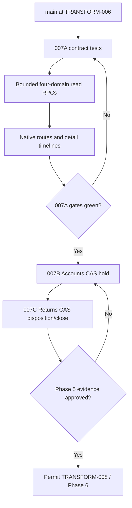
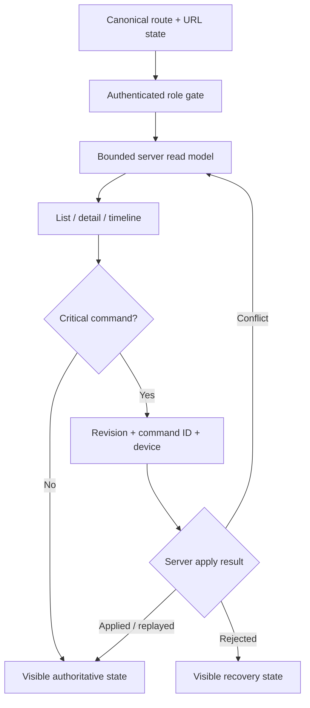

# Work Package: `TRANSFORM-007 Operational Records`

## Objective

Complete the Phase 5 operational and commercial read loop by making Inventory,
Customers, Accounts and Returns first-class, bounded, server-authoritative routes
inside the unified shell. Critical Accounts and Returns writes remain withheld
until a later package in the same phase supplies revision, idempotency and audit
contracts.

## Owner and reviewers

- Implementation role: Platform/Data + Frontend on
  `agent/product/transform-007-operational-records-v2`
- Verification role: independent Verification approval required
- Chief Engineer: protected route, migration and shell review required
- Dependencies: merged `TRANSFORM-005` product identity/warehouse authority and
  merged `TRANSFORM-006` delivery/driver authority
- Planned merge order: `007A` authoritative reads/routes, then `007B` Accounts
  hold command, then `007C` Returns disposition/closure commands

## In scope

- Allowed paths:
  - `docs/engineering/work-packages/TRANSFORM-007-operational-records.md`
  - `supabase/migrations/20260811*transform_007*`
  - `scripts/transform-007-*`
  - `.github/workflows/transform-007-*`
  - `src/data/repositories/operationalRecords.ts`
  - `src/features/operationalRecords/**`
  - bounded integration edits to `src/main.tsx`,
    `src/features/intelligence/navigation/routeContract.ts`,
    `src/features/navigation/OperationalAppShell.tsx` and
    `src/features/operationalRoutes/UnifiedOperationalRoutes.tsx`
- Allowed behaviour changes:
  - add `/accounts`, `/returns` and their canonical detail paths to the unified
    shell while preserving legacy `/reconciliation`;
  - replace generic Inventory and Customer tables with native Phase 5 list and
    detail surfaces;
  - expose exact-count, bounded page reads and bounded detail timelines;
  - show account holds, reasons, dates, affected value/status and release-role
    policy in Accounts and Customer detail;
  - show every return from report through disposition, including whether the
    inventory consequence is explicit;
  - retain existing governed Warehouse cycle-count commands as links/read state,
    not duplicate them in Inventory.

## Out of scope

- Forbidden paths:
  - Delivery/Driver domain cores and route-authority migrations;
  - Ordermentum import, mirror and invoice-detail sync workflows;
  - Analytics implementation or Phase 6 forecasting/scoring;
  - legacy Inventory, Stores, Accounts enhancer and Returns panel rewrites;
  - existing deployed migration edits.
- Behaviour that must remain unchanged:
  - Ordermentum owns commercial order, invoice, payment, pricing and customer
    master facts;
  - approved warehouse ledger/location balances remain the physical authority;
  - existing Orders account-hold gating remains visible and fail closed;
  - Warehouse and Driver continue using their dedicated role surfaces;
  - no new DOM observer/enhancer or broad all-domain first-paint loader;
  - the two independent Ordermentum CI sync failures are not repaired or waived
    by this package.

## Behaviour contract

### `007A` bounded reads and routes

- Input: authenticated workspace, view, page, page size, search/filter/sort, or a
  canonical record identifier.
- Accepted result: exact total plus at most 100 rows, or bounded typed detail
  records plus one server read timestamp.
- Conflict result: not applicable because `007A` is read-only.
- Rejected result: unknown workspace/view, invalid page/limit/identifier or an
  unauthorised role fails closed; no cached cross-role fallback is rendered.
- Authoritative server checks: active authenticated profile and explicit
  workspace role allow-list are evaluated inside each security-definer RPC.
- Revision/idempotency/actor/device: no mutation is exposed in `007A`; current
  object revision is returned wherever a later command will require it.
- Offline policy: read failure renders unavailable/stale-safe state. No command
  is queued or reported successful.
- Audit/error behaviour: reads do not create business events. Errors preserve
  server codes/messages and never substitute sample data in production.

### `007B` Accounts hold command gate

- Command: set or clear a store release hold with target state, mandatory reason,
  expected revision, UUID command id and bounded device id.
- Accepted result: `APPLIED` plus authoritative hold snapshot and incremented
  revision; affected Orders continue consuming the same hold authority.
- Conflict result: `CONFLICT` plus current snapshot, with no mutation.
- Retry result: same command/payload returns `REPLAYED`; a reused command id with
  different intent is rejected.
- Authoritative checks: authenticated `OWNER`, `ADMIN` or `ACCOUNT`, known store,
  current revision and non-empty reason.
- Audit: append-only command/event evidence records actor from `auth.uid()`, role,
  device, reason, before/after state and timestamp.
- Offline policy: pending until server acknowledgement; no optimistic success.

### `007C` Returns disposition and close gate

- Command: record an inspected disposition or close a return using expected
  revision, UUID command id, device id and mandatory evidence/note.
- Accepted result: `APPLIED` plus authoritative lifecycle snapshot. Restock must
  reference its inventory movement; non-restock dispositions must be explicit.
- Conflict/retry behaviour: same CAS and idempotency semantics as `007B`.
- Rejected result: return not physically received, unsupported transition,
  missing barcode/location for restock, missing consequence, wrong role, or
  stale revision fails closed.
- Authoritative checks: authenticated `OWNER`, `ADMIN` or `WAREHOUSE`; current
  return state and complete consequence evidence.
- Audit: append-only actor/device/reason/before/after/linked movement evidence.
- Offline policy: pending until server acknowledgement; no local closure.

## Phase flow

## Runtime authority flow

## Acceptance criteria

- [x] Inventory exposes Overview, By SKU, By location, Below target,
  Negative/inconsistent, Movement ledger and Cycle count views.
- [x] Inventory SKU detail uses the live location ledger and exposes commercial
  SKU/family, physical SKUs, packages, barcodes, demand, target, movements and
  unresolved identity exceptions where data exists.
- [x] Customers expose Overview, Orders, Delivery, Pricing, Accounts, Contacts
  and Timeline without fetching unbounded cross-domain datasets.
- [x] Accounts show hold reason, effective time, open/overdue value/status and
  release-role policy; Orders hold behaviour remains covered.
- [x] Returns show reported, received, inspected, disposition, consequence and
  closed state; missing consequence is explicit rather than inferred away.
- [x] `/inventory`, `/customers`, `/returns` and `/accounts` are first-class
  unified routes with shareable filter/detail URL state.
- [x] Role/RPC tests prove Account cannot read Inventory, Viewer cannot read
  Accounts/Returns and public/anon cannot execute the read RPCs.
- [x] First paint fetches only the selected workspace page; detail fetches are
  bounded and start only after a record is selected.
- [x] Existing Control Room, Orders, Warehouse, Delivery/Driver and legacy
  `/reconciliation` remain usable.
- [x] `007B` and `007C` commands are not exposed until their CAS, replay,
  rejection, RLS and audit tests pass.

## Test plan

| Layer | Command or scenario | Expected result |
|---|---|---|
| Static | `node scripts/audit-transform-007-operational-records.mjs` | migration, role, bound and route invariants pass |
| Unit | `node --experimental-strip-types --test scripts/transform-007-operational-records-frontend-contract.test.mjs` | canonical route/repository/surface contract passes |
| Integration/RLS | PostgreSQL fixture + `scripts/transform-007-operational-records-contract-test.sql` | pagination, detail, role denial and consequence facts pass |
| Build | `npm run typecheck && npm run build` | production TypeScript and bundle pass |
| Regression | existing operational safety and repository hygiene audits | earlier transformation gates stay green |
| End-to-end/UI | authenticated Owner, Account and Viewer route matrix | correct routes, empty/error states, URL detail and denial states render |

## Required evidence

- Changed files: versioned read migration, repository, native workspace/CSS,
  canonical route/shell integration, static/frontend/PostgreSQL contracts,
  workflow and this work package.
- Build and test output: local TypeScript, Vite production build, five new
  frontend contracts, sixteen routed-shell regressions, 78 operational-safety
  contracts, full intelligence audit, warehouse/Returns ACL/production-boundary
  audits and repository hygiene passed on 2026-08-11.
- Migration/shadow result: the fixture, migration and behavioural contract pass
  in local embedded PostgreSQL. PostgreSQL 16 CI and Supabase shadow validation
  remain mandatory before merge and are intentionally not claimed yet.
- Screenshots: Owner desktop list/detail for all four domains plus one denied-role
  state required before merge.
- Risks: historical return rows may expose missing consequence evidence; this is
  a surfaced data-quality state, not silently repaired.
- Known limitations: `007A` is deliberately read-only.
- Deferred findings: Ordermentum catalog `[object Object]` failure and invoice
  detail PostgreSQL `57014` timeout remain independent release-health blockers.

## Rollback

Remove route authority and frontend/repository files in a normal revert. If the
read migration has deployed, add a forward compensating migration that revokes
and drops the new versioned RPCs; never edit the deployed migration. Read-only
objects create no business-data rollback requirement. Later command packages
must preserve append-only audit rows even when UI authority is rolled back.

## Decision log

### Decisions

- `TRANSFORM-007` starts after merged `006`; the remote
  `agent/transform-007-operational-records` pointer has zero commits ahead of
  main and is not a valid continuation branch.
- Phase 5 is split by authority boundary, not by arbitrary UI slices.
- `/accounts` becomes the product route; `/reconciliation` remains a preserved
  legacy route and is not deleted in this package.
- Existing unsafe mutation RPCs are not imported into the native Phase 5 UI.

### Assumptions

- Exact Ordermentum/store IDs remain the commercial identity authority.
- Existing Orders read models continue overlaying `ecoflow_account_release_holds`.
- Historical Returns data is shown as recorded, including incomplete evidence.

### Risks

- Cross-domain historical identifiers may not always link; unmatched relations
  must render as unavailable, never be joined by fuzzy name inference.
- Protected shell, route and migration files require independent review.

### Deferred

- Analytics/forecasting (`TRANSFORM-008`) is forbidden until Phase 5 approval.
- Source-sync failures are handled in a separate bounded work package only after
  explicit approval.
